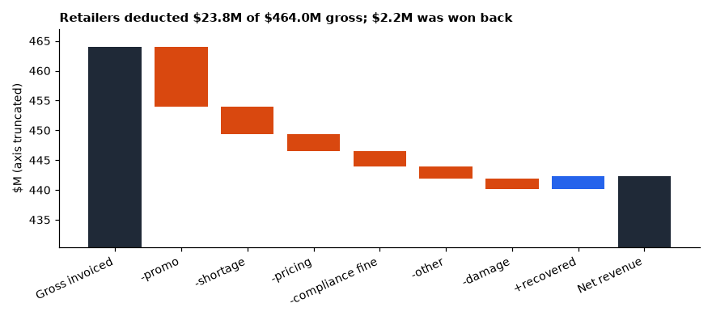
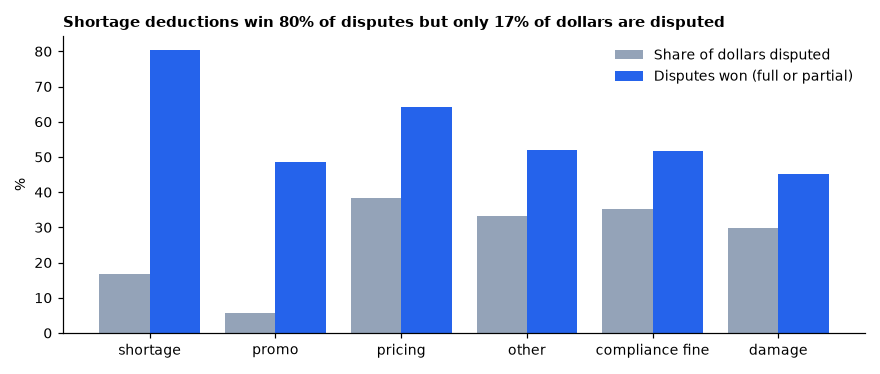
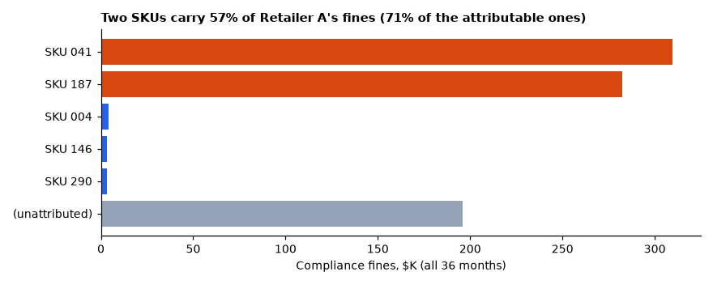
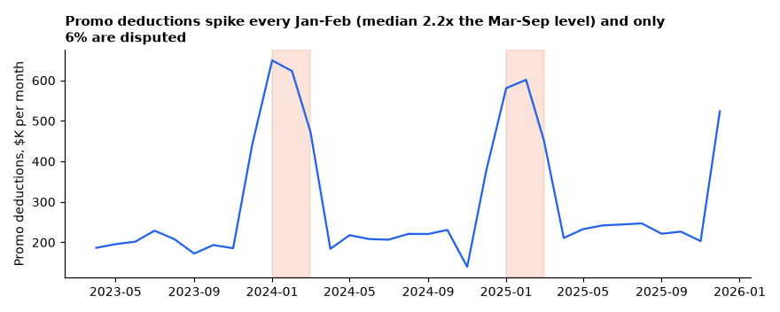
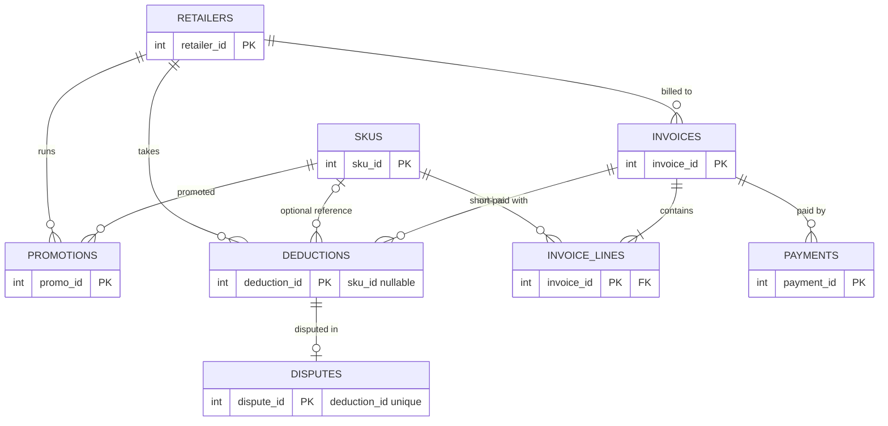
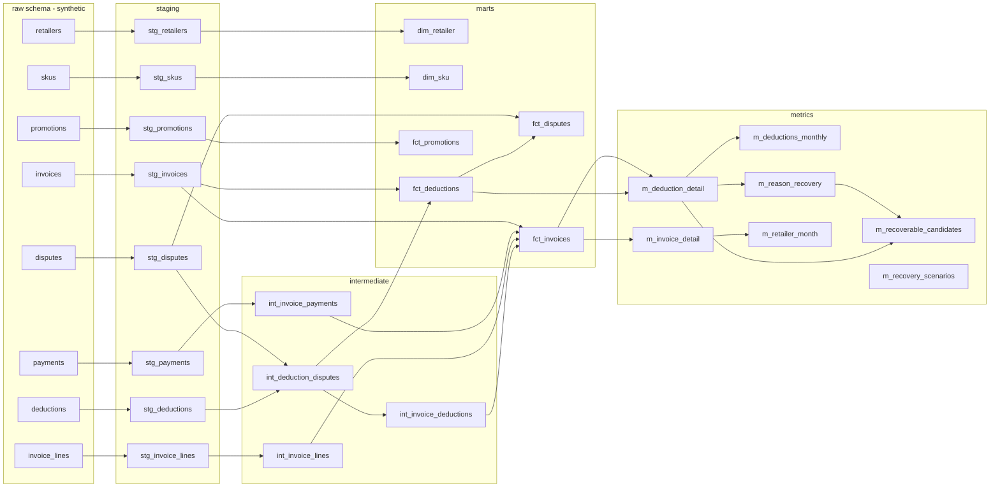
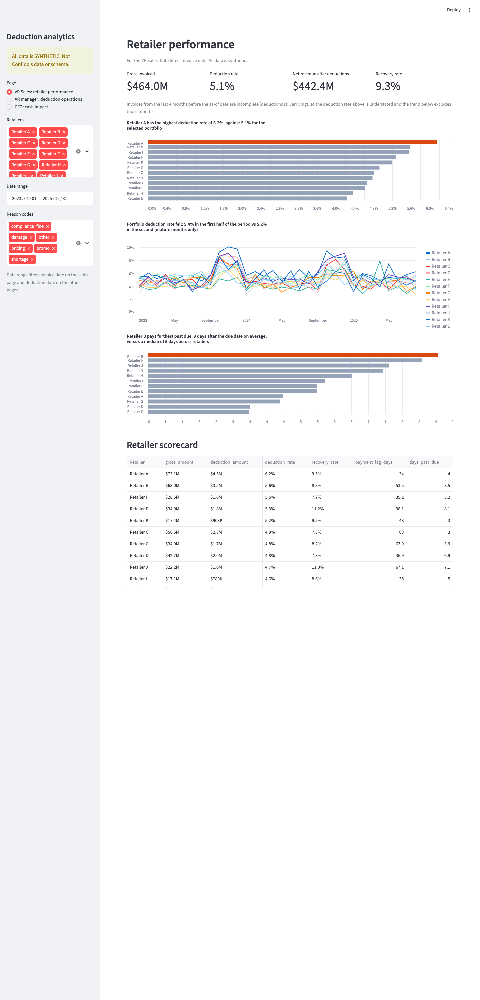
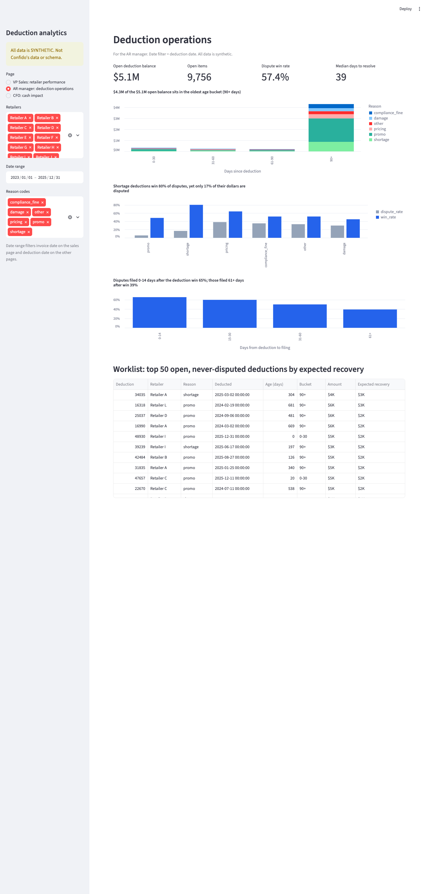
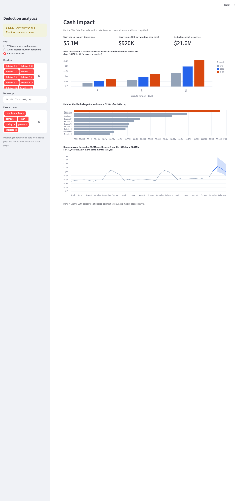

# CPG Deduction & Trade Spend Analytics

> **Everything in this repository is synthetic.** The data are generated by code here for a fictional mid-size CPG
> brand ("Northfield Foods"). They are not Confido's data or schema and describe no real company. **The findings below
> demonstrate a method on data with planted patterns; they are not discoveries about real retailers.** Every number is
> produced by `scripts/build_findings.py` from SQL on the built warehouse and written to
> [docs/findings.json](docs/findings.json); this file is rendered from [docs/README.template.md](docs/README.template.md),
> and `scripts/verify_readme.py` re-derives every number in it from the raw tables.

**[Open the live site, with an interactive dashboard](https://jainamh029.github.io/cpg-deduction-analytics/)**

**Status:** a self-audit (a second, adversarial review pass over the project, not a third-party review) ([docs/AUDIT_REPORT.md](docs/AUDIT_REPORT.md)) found and fixed false positives, messy-data gaps and
overclaims; open items are listed there. CI (`make all` on Ubuntu, Python 3.11) passed on GitHub Actions on its first run after the audit; that is one run, not a track record. The dashboard is
Streamlit; Metabase was **not built or verified** ([docs/METABASE_NOTES.md](docs/METABASE_NOTES.md)). Screenshots are real captures.

## Headline (in the synthetic dataset)

Across 36 months, the synthetic retailers deducted **$23.8M** from **$464.0M**
of gross invoices (5.1% overall). Recent invoices are still collecting deductions, so that rate is understated:
on invoices old enough to be complete (4+ months) it is **5.3%**. Disputes won back $2.2M
so far (9.3% of deducted dollars), leaving $21.6M deducted net of recoveries to date
(4.7% of gross). This is a to-date total in an artificial dataset, not an annual loss estimate for any real company.

**Recoverable dollars: a range, not a point.** Deductions younger than 180 days that were never disputed, valued at their reason's *historical*
win rate and recovery ratio, are worth $1.2M. Because AR teams dispute the deductions they expect to win,
history overstates what undisputed deductions would win. A simulation in this repo (the audit's selection-bias mode, where the true win
probability of every deduction is known) puts the true value of the same deductions at 76% to 98% of the
historical-rate estimate, depending on how strong the selection is. The reported range applies realization factors of 0.5, 0.75 and 1.0:
**$613K to $1.2M** (base $920K); with a 365-day dispute window the base case is
$1.9M. The factors are assumptions; the 0.5 end is a stress case beyond what the simulation produced. The same method on data with no planted
pattern at all returns about $644K (base case, averaged over 20 datasets), so this figure measures volume and rates,
not evidence that a pattern exists.



## Finding 1: shortage recovery looks under-invested

**Evidence.** Shortage deductions ($4.6M) win **80%** of resolved disputes, the highest of any reason, but only
**17%** of shortage dollars are disputed. Pricing, compliance, damage and "other" deductions have 35% of their dollars disputed and win 54% of disputes. (Promo is disputed even less, see finding 3, but wins only 48%.) 5,616 shortage deductions worth
$2.7M were never disputed and are still open or written off; at historical rates that is up to **$1.9M** over 36 months
(about $619K a year), an upper bound. **Selection caveat:** the 80% is measured on deductions someone chose to dispute. In the selection-bias simulation the
observed shortage win rate rises from 77% to 88% while the true win probability of the undisputed ones stays near
75%, so the gap between "wins when disputed" and "would win if disputed" can be large. Timing: disputes filed 0-14 days after the deduction win 65%; those filed 61+ days after win 39%. *The generator builds the filing-lag effect in, so this demonstrates the analysis, not a real behavior.*



**If this pattern appeared in real data**, the action would be to dispute shortage deductions systematically (proof-of-delivery matching, within about two weeks) and to measure the
realized win rate on the newly disputed ones before counting any recovery.

## Finding 2: one retailer's compliance fines run 3.7x peers, concentrated in two SKUs

**Evidence.** Retailer A's compliance fines are 1.41% of its gross, 3.7x the peer median (0.39%): $1.0M in fines, about
$752K more than the peer rate would imply. SKU 041, SKU 187 carry **71%** of the fines that have a SKU reference, or **57%**
of all fines once the 19% with no SKU reference are counted (a dilution of 13.4 points; if the unattributed fines are concentrated in the same two SKUs the true figure is higher).
**Threshold honesty:** "outlier" means at least 2.0x the peer median. On 20 datasets with no planted effect the largest ratio was 1.98x; on 20 datasets with the planted effect the smallest was
2.04x. The two groups are separated, but narrowly.



**If this pattern appeared in real data**, the concentration in two SKUs would point to a fixable upstream compliance cause (labelling, packaging, routing). Compliance disputes win only 52% of the time, so disputing alone recovers just part of the cost.

## Finding 3: promo deductions spike after Q4 and are rarely disputed

**Evidence.** Promo is the largest deduction category: $10.0M, 42% of all deducted dollars. Promo deductions in January-February run a median
**2.2x** their March-September monthly level (22 of 24 retailer-years are at least 1.5x; with no planted effect the median never exceeded
1.27x). Only 5.8% of promo dollars are disputed, and the disputes filed win 48%. $6.6M of promo deductions were never disputed and are open or written off.



**If this pattern appeared in real data**, promo deductions would need matching to promotion agreements before payment; many are legitimate trade spend, so the $2.8M historical-rate upper bound
is not a savings estimate, and promo deductions are linked to promotions only at retailer-year level here.

## Also noticed

- **One retailer is paying later.** Retailer B's payment lag is 63.1 days from invoice, up 9.1 days over six months; the next largest change is 0.0 days
  (analysis 08, mature months only). On datasets with no planted drift the largest change was 1.5 days.
- **Anomaly detection.** The z-score query flags 4 of 1,512 scored retailer x reason x month cells at |z| >= 4.5, including the planted Retailer E shortage spike (2025-05).
  Recurring post-Q4 promo spikes also flag because seasonality is not removed. The audit measured 3.1 flagged cells per dataset on data with no planted anomaly (it was 25.6 at the original |z| >= 3 threshold) and found the planted spike on
  19 of 20 datasets with it.

## Forecast

Monthly deduction dollars by retailer, rolling-origin backtest (first origin after 24 months, 3-month horizon, 7 origins). Holt-Winters had pooled MAPE **18.6%** versus
**18.9%** for the seasonal-naive baseline and was better for 8 of 12 retailers. Resampling origins, the advantage is 0.21 MAPE points
(95% CI -2.22 to 2.74; bootstrap p = 0.89; Diebold-Mariano p = 0.92): **a statistical tie**, so neither model is shown to be better.
Next three months (2026-01 to 2026-03): $3.4M (band $2.7M to $4.6M) versus $2.9M a year earlier.
The band is nominally 80%; measured out of sample it covered 77.3% of backtest points. Details, sMAPE/MASE and caveats: [forecast/RESULTS.md](forecast/RESULTS.md).

## How the detectors were checked

- **Null datasets.** The generator can produce data with the same volume and noise but no planted effect. On 20 such datasets the original detectors raised false alarms (one "under-invested" reason in 19 of 20,
  about 25.6 anomaly cells each); after the audit's threshold fixes, 0 of 20 and about 3.1.
- **Seed sweep.** On 20 planted datasets (different seeds) the detectors found the fine outlier on 20, the promo spike on 20, the shortage gap on 20, the lag drift on 20,
  the growth/seasonality on 20 and the one-off anomaly on 19.
- **Mutation tests.** Deliberately injected bugs (fan-outs, join changes, boundary and denominator errors, forecast leakage) are run against the test suite: [docs/AUDIT_REPORT.md](docs/AUDIT_REPORT.md).

## Method

- **Data.** A seeded generator (seed 20260101) writes 48,178 invoices, 482,139 invoice lines, 49,008 deductions and 11,877 disputes for 12 retailers and
  300 SKUs over 36 months (as of 2025-12-31), with planted, noisy patterns documented with target versus observed values in [PLANTED_PATTERNS.md](PLANTED_PATTERNS.md). A separate unconstrained `raw_dirty` load carries injected
  defects; the validator reports exactly those (`fk_deductions_invoice` x3, `nonpositive_deduction_amount` x3, `recon_overpaid_invoice` x3, `duplicate_payments` x3) and nothing on the clean load (no findings). `make build` runs the validator first and stops on any finding.
- **Warehouse.** DuckDB; dbt (staging, intermediate, marts, metrics) with not_null, unique, relationships and accepted_values tests. Children are aggregated to the parent grain before joins and mart totals are tested against raw totals.
- **Metrics.** 11 metrics defined once as DuckDB macros in the `metrics` schema ([docs/METRICS.md](docs/METRICS.md)); analysis SQL and the dashboard reuse them (checked by a heuristic test), and metrics are verified against hand-computed fixtures, including a messy-data fixture.
- **Analysis.** 10 SQL files in [sql/analysis](sql/analysis), each verified against independently written SQL on the raw tables. One optimization is measured in [docs/PERFORMANCE.md](docs/PERFORMANCE.md).
- **SKU attribution.** 49.3% of deductions (53.3% of dollars) have no SKU reference. Every SKU-level result keeps them in an explicit `(unattributed)` bucket.

## Data model



Lineage, generated from dbt's manifest (more in [docs/data_model.md](docs/data_model.md)):



## Dashboard (Streamlit)

Three pages for three users, with retailer, date and reason filters; every chart title states its takeaway. Reads only marts, metrics and the forecast output.

| VP Sales | AR manager | CFO |
|---|---|---|
|  |  |  |

## How to run

Requires Python 3.11 and (for screenshots) Google Chrome. Dependencies are exactly pinned in `pyproject.toml` and `requirements.lock`.

```bash
make all PY=python3.11     # setup, lint, synthetic data, validation gate, dbt build + tests, forecast, findings, pytest
streamlit run dashboard/app.py   # after `make all`; ?page=sales|ops|cfo
make screenshots           # optional: .venv/bin/pip install -e ".[screenshots]" first
```

## Limitations

- **Synthetic data.** Patterns are planted, so finding them demonstrates the pipeline, not what real retailers do. Some effects (win rate falling with filing lag, a constant lag drift) are built in by construction.
- **Selection bias.** Recoverable-dollar figures are ranges for that reason; the real selection is unknown. The realization factors are assumptions.
- **Not modelled.** Returns, credit memos and chargebacks (the schema rejects negative amounts), one dispute per deduction in the raw schema, one payment per invoice, no receivable-balance metric, deductions linked to promotions only at retailer-year level, no currency or time zones (all dates are plain dates).
- **Messy data.** Duplicate deductions, re-filed disputes and recoveries above the deduction amount are flagged by the validator (and recoveries are capped in the model), but duplicates are not removed.
- **Censoring.** Recent invoice months are incomplete (4-month maturity rule); days-to-resolve and win rate cover resolved disputes only, so they are biased toward quick outcomes; the first three deduction months are ramp-up.
- **Forecast.** 33 usable months, 7 overlapping origins, two models, and no demonstrated winner.
- **Not verified.** Metabase (never built). CI has passed once on Ubuntu; macOS arm64 is the only other platform tested.

## What I would do with real customer data

1. Replace the generator with extracts of remittance, deduction and claim documents; first measure the **real** SKU null rate and the dispute selection bias, which decide how much of the recoverable range is real.
2. Link deductions to promotion agreements and proof-of-delivery documents so valid and invalid come from evidence instead of dispute outcomes.
3. Add retailer-specific dispute windows and rules, plus a per-deduction win-probability model to prioritise the worklist.
4. Backtest forecasts on years of real history and report intervals with measured coverage.
5. Verify CI on GitHub and, if Metabase is wanted, run the spike described in the Metabase notes.

See also: [docs/AUDIT_REPORT.md](docs/AUDIT_REPORT.md), [docs/DECISIONS.md](docs/DECISIONS.md), [docs/BUILD_LOG.md](docs/BUILD_LOG.md), [docs/FINAL_REPORT.md](docs/FINAL_REPORT.md), [PLAN.md](PLAN.md).
