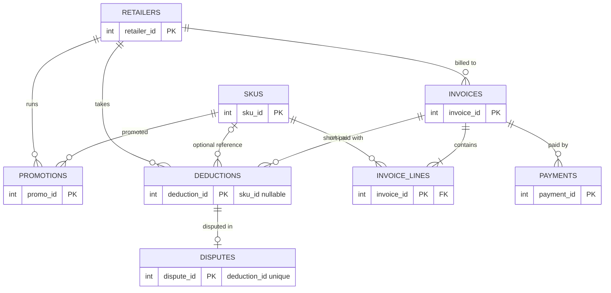
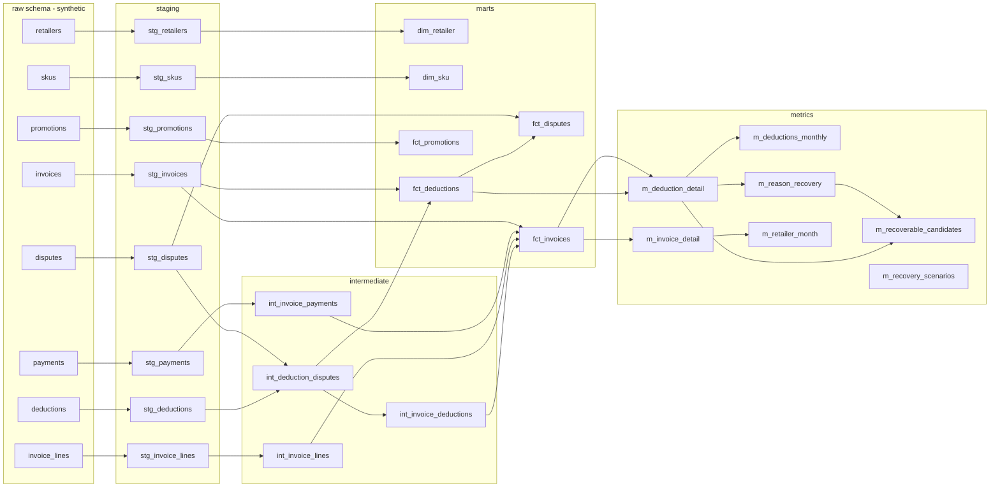

# CPG Deduction & Trade Spend Analytics

> **All data in this repository is synthetic.** It is generated by code here for a fictional mid-size CPG brand
> ("Northfield Foods"). It is not Confido's data or schema, and nothing here should be read as describing any real
> company. Every number below is produced by `scripts/build_findings.py` from SQL on the built warehouse and written
> to [docs/findings.json](docs/findings.json); this file is rendered from [docs/README.template.md](docs/README.template.md).

**Status:** CI workflow written but **unverified** (it has never run on GitHub). The dashboard is Streamlit; a
Metabase version was **not built or verified** (no Docker on the dev machine, see [docs/METABASE_NOTES.md](docs/METABASE_NOTES.md)).
Dashboard screenshots are real captures of the running app.

## Headline

Over 36 months, retailers deducted **$23.8M** (5.1%) from
**$464.0M** of gross invoices. Disputes won back $2.2M
(9.3% of deducted dollars), so **$21.6M was lost net**
(4.7% of gross, about $7.2M a year).

Of that, **$920K is realistically recoverable now** (base case; $613K
to $1.2M across scenarios): deductions younger than 180 days that were never disputed,
valued at their reason's historical win rate and recovery ratio, then haircut by an *assumed* realization factor
(0.5 / 0.75 / 1.0). With a 365-day dispute window the base case is $1.9M.
The haircuts are assumptions, not measurements.


## Finding 1: shortage recovery is under-invested

**Evidence.** Shortage deductions ($4.6M) win **80%** of resolved disputes,
the highest of any reason, but only **17%** of shortage dollars are disputed. Pricing, compliance,
damage and "other" deductions are disputed 35% of the time and win
54%. (Promo is disputed even less, see finding 3, but wins only 48%.)
5,616 shortage deductions worth $2.7M were never disputed and are still
open or written off; at the historical win rate and recovery ratio that is up to **$1.9M** over 36 months
(about $619K a year). Timing matters in this data too: disputes filed within 0-14
days win 65%, those filed after 61+ days win 39%. *The filing-lag
effect is built into the synthetic generator, so it demonstrates the analysis, not a real-world finding.*


**Recommended action.** Dispute every shortage deduction automatically within 14 days, using proof-of-delivery matching, and track
the shortage dispute rate against a target. The figure above is an *upper bound*: people tend to dispute the deductions they expect
to win, so undisputed shortages will probably win less often than disputed ones did (the synthetic data has no such selection effect).

## Finding 2: Retailer A compliance fines run 3.7x peers, concentrated in two SKUs

**Evidence.** Retailer A's compliance fines are 1.41% of its gross, 3.7x the peer median
(0.39%); that is $1.0M in fines, roughly $752K more than the peer
rate would imply ($251K a year). SKU 041, SKU 187 carry **71%** of the fines that have a SKU
reference, or **57%** of all fines once the 19% with no SKU reference are counted. Missing SKU references
dilute the concentration by 13.4 points but do not hide it; if the unattributed fines are concentrated in the same two SKUs, the true figure is higher.


**Recommended action.** Treat this as an upstream compliance problem, not a dispute problem: only 52% of compliance-fine disputes
are won. Audit labelling, packaging and routing requirements for the two SKUs with Retailer A's compliance team, and ask the retailer to put SKU
references on every fine so the unattributed share shrinks.

## Finding 3: promo deductions spike after Q4 and are rarely disputed

**Evidence.** Promo is the largest deduction category: $10.0M, 42% of all deducted dollars. Promo deductions in
January-February run a median **2.2x** their March-September monthly level (22 of
24 retailer-years are at least 1.5x), consistent with claims arriving after Q4 promotions. Only 5.8% of promo
dollars are disputed, and the disputes that are filed win 48%. $6.6M of promo deductions were never disputed and are
open or written off.


**Recommended action.** Match promo deductions to promotion agreements before they are paid, starting in the Q4 claim window, and dispute the ones without a valid
promotion. Caution: many promo deductions are legitimate trade spend. The $2.8M historical-rate upper bound
(about $923K a year) is an *upper bound*, and promo deductions are linked to promotions only at retailer-year level here,
not row by row.

## Also noticed

- **Retailer B is paying later.** Its payment lag is 63.1 days from invoice, up 9.1 days over six months; the next
  largest change is 0.0 days (analysis 08, mature months only).
- **One-off anomaly.** The z-score query flags 34 retailer x reason x month cells out of 1,512 scored, including a
  Retailer E shortage spike in 2025-04, 2025-05 (planted in the generator to test the detector). Recurring post-Q4 promo spikes also flag because seasonality is not removed.

## Forecast

Monthly deduction dollars by retailer, rolling-origin backtest (first origin after 24 months, 3-month horizon). Holt-Winters had pooled MAPE
**18.6%** versus **18.9%** for the seasonal-naive baseline, and was better for
8 of 12 retailers. With only a handful of overlapping folds that is a statistical tie, not a win; per-retailer
results, losses and caveats are in [forecast/RESULTS.md](forecast/RESULTS.md). Next three months (2026-01 to 2026-03):
$3.4M (80% band $2.7M to $4.6M, an empirical band from backtest errors) versus
$2.9M in the same months a year earlier.

## Method

- **Data.** A seeded generator (seed 20260101) writes 48,178 invoices, 482,139 invoice lines, 49,008 deductions and 11,877 disputes
  for 12 retailers and 300 SKUs over 36 months (as of 2025-12-31), with planted, noisy patterns documented with target versus observed values in
  [PLANTED_PATTERNS.md](PLANTED_PATTERNS.md). A separate unconstrained `raw_dirty` load carries injected defects; the validator reports exactly those
  (`fk_deductions_invoice` x3, `nonpositive_deduction_amount` x3, `recon_overpaid_invoice` x3, `duplicate_payments` x3) and nothing on the clean load (no findings).
- **Warehouse.** DuckDB; dbt (staging, intermediate, marts, metrics) with not_null, unique, relationships and accepted_values tests. Child tables are aggregated to the parent grain before joins, and
  mart totals are tested against raw totals.
- **Metrics.** Eleven metrics defined once as DuckDB macros in the `metrics` schema ([docs/METRICS.md](docs/METRICS.md)); analysis SQL and the dashboard reuse them, and a test fails if they re-derive a formula.
  Metrics are checked against hand-computed values on a tiny fixture.
- **Analysis.** Ten SQL files in [sql/analysis](sql/analysis) (chained CTEs, LAG, rolling windows, RANK, aging buckets, filing-lag cohorts, z-scores against a trailing 12-month baseline, a waterfall,
  fan-out-safe joins), each verified in tests against independently written SQL on the raw tables. One optimization is measured in [docs/PERFORMANCE.md](docs/PERFORMANCE.md).
- **SKU attribution.** 49.3% of deductions (53.3% of dollars) have no SKU reference. Every SKU-level result keeps them in an explicit `(unattributed)` bucket.

## Data model



Lineage, generated from dbt's manifest (more in [docs/data_model.md](docs/data_model.md)):



## Dashboard (Streamlit)

Three pages for three users, with retailer, date and reason filters; every chart title states its takeaway. Reads only marts, metrics and the forecast output.

| VP Sales | AR manager | CFO |
|---|---|---|
|  |  |  |

## How to run

Requires Python 3.11 and (for screenshots) Google Chrome.

```bash
make all PY=python3.11     # setup, lint, synthetic data, dbt build + tests, forecast, pytest
make findings              # rebuild docs/findings.json, charts and this README, then verify the numbers
streamlit run dashboard/app.py   # after `make all`; ?page=sales|ops|cfo
make screenshots           # optional: .venv/bin/pip install -e ".[screenshots]" first
```

## Limitations

- **Synthetic data.** The patterns are planted, so finding them demonstrates the pipeline, not what real retailers do. Some effects (win rate falling with filing lag, a constant lag drift) are built in by construction.
- **Selection bias is absent.** Real disputed deductions are not a random sample, so recoverable-dollar figures are upper bounds; the scenario factors (0.5 / 0.75 / 1.0) are assumptions.
- **Simplifications.** One dispute per deduction; one payment per invoice; payments equal gross less deductions; deductions have no promotion ID (linked at retailer-year level); no returns, chargebacks reversal or currency.
- **Censoring.** Recent invoice months are incomplete (4-month maturity rule) and the first three deduction months are ramp-up; both are excluded where it matters.
- **Forecast.** 33 usable months, 7 overlapping origins, two models; the comparison is statistically weak and the data are smoother than real deductions.
- **Not verified.** GitHub Actions CI (never run) and Metabase (never built).

## What I would do with real customer data

1. Replace the synthetic generator with extracts of remittance, deduction and claim documents; first task is to measure the **real** SKU null rate and dispute selection bias, which decide how much of the recoverable range is real.
2. Link deductions to promotion agreements and proof-of-delivery documents so valid and invalid can be classified from evidence instead of dispute outcomes.
3. Add retailer-specific dispute windows and rules, and a recovery model that predicts win probability per deduction (reason, retailer, amount, filing lag) to prioritise the worklist.
4. Backtest forecasts on years of real history and report intervals, not point values.
5. Verify CI on GitHub and, if Metabase is wanted, run the spike described in the Metabase notes.

See also: [docs/DECISIONS.md](docs/DECISIONS.md), [docs/BUILD_LOG.md](docs/BUILD_LOG.md), [docs/FINAL_REPORT.md](docs/FINAL_REPORT.md), [PLAN.md](PLAN.md).
