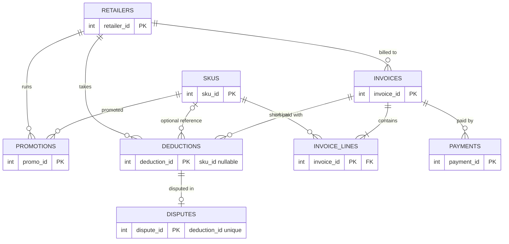
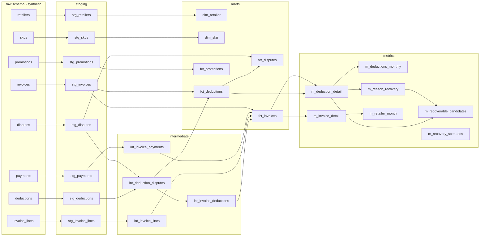

# Data model (SYNTHETIC data)

> All data is synthetic. Not Confido's data or schema. The raw tables are modelled on common CPG
> receivables concepts and are an illustration only.

## Raw schema (ERD)

`deductions.sku_id` is nullable; every SKU-level metric keeps those rows in an explicit `(unattributed)` bucket.
`disputes.deduction_id` is unique (one dispute per deduction, a simplification).

## Model grain

| Layer | Model | Grain |
|---|---|---|
| staging | `stg_*` (8) | one row per raw row, typed and renamed |
| intermediate | `int_invoice_lines` | one row per invoice |
| intermediate | `int_invoice_payments` | one row per invoice with a payment |
| intermediate | `int_deduction_disputes` | one row per deduction (dispute folded in) |
| intermediate | `int_invoice_deductions` | one row per invoice with a deduction |
| marts | `dim_retailer` | one row per retailer |
| marts | `dim_sku` | one row per SKU plus the `(unattributed)` row |
| marts | `fct_invoices` | one row per invoice |
| marts | `fct_deductions` | one row per deduction |
| marts | `fct_disputes` | one row per dispute |
| marts | `fct_promotions` | one row per promotion |
| metrics | `m_deduction_detail`, `m_invoice_detail` | deduction / invoice, with row-level metric attributes |
| metrics | `m_retailer_month` | retailer x invoice month |
| metrics | `m_deductions_monthly` | retailer x reason x deduction month |
| metrics | `m_reason_recovery` | reason code |
| metrics | `m_recoverable_candidates` | never-disputed open or written-off deduction |
| metrics | `m_recovery_scenarios` | dispute window x scenario |

Authoritative grain statements are in each layer's `schema.yml`.

## Lineage (generated from dbt's manifest by `scripts/lineage.py`)

