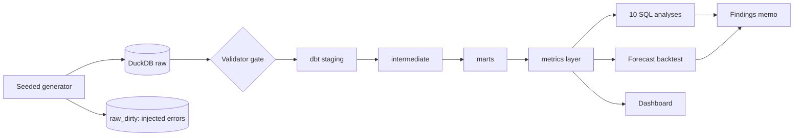

# CPG Deduction & Trade Spend Analytics

**A portfolio project on synthetic data: where does a consumer-goods brand lose money to retailer deductions, and how much of it can be won back?**

[Open the interactive dashboard](dashboard/) &nbsp;|&nbsp; [Read the findings memo](memo.html) &nbsp;|&nbsp; [Audit report](docs/AUDIT_REPORT.md) &nbsp;|&nbsp; [Interview Q&A](docs/INTERVIEW_QA.md) &nbsp;|&nbsp; [Source code](https://github.com/jainamh029/cpg-deduction-analytics)

> **Everything here is synthetic.** A fictional brand ("Northfield Foods") generated by code. It is not Confido's data or schema and describes no real company. The findings show that the method works on planted patterns; they are not discoveries about real retailers.

## The problem in one paragraph

A consumer-goods brand ships product to retailers and sends invoices. Retailers often pay less than the invoice and subtract **deductions**: product they say never arrived (shortage), promotions they say they funded (promo), compliance fines, pricing differences, damage. Each deduction can be accepted, written off, or **disputed** and sometimes won back. Finance teams usually suspect they are losing money but cannot see *which retailers*, *which reasons*, *how old*, or *how much is realistically recoverable*.

## What this project does

1. **Builds a realistic test world.** A seeded generator creates {{ meta.invoices|int }} invoices ({{ meta.invoice_lines|int }} lines), {{ meta.deductions|int }} deductions and {{ meta.disputes|int }} disputes for {{ meta.retailers|int }} retailers and {{ meta.skus|int }} SKUs over {{ meta.months }} months, with known, noisy patterns planted in it, plus a separate "dirty" copy with deliberate data errors.
2. **Loads and validates it.** DuckDB warehouse with constraints; a rule-based validator must pass before anything is transformed.
3. **Models it.** dbt layers (staging, intermediate, marts, metrics) that avoid the classic double-counting trap when one invoice has many deductions and each deduction can have a dispute.
4. **Defines every metric once** (deduction rate, recovery rate, net revenue after deductions, open balance, ageing, days to resolve, win rate, valid vs invalid, payment lag, recoverable dollars) and reuses it everywhere.
5. **Answers business questions in SQL** (gross-to-net waterfall, trends, ageing, whether filing disputes faster wins more, anomaly flags, payment-lag drift, recoverable dollars) and **forecasts** monthly deductions with a backtest.
6. **Shows it** in a three-page dashboard for a VP Sales, an AR manager and a CFO, and **audits itself**: tests, injected bugs, no-pattern datasets and a selection-bias simulation.

## Try the dashboard

<iframe src="dashboard/" title="Interactive dashboard" style="width:100%;height:900px;border:1px solid #cbd5e1;border-radius:8px" loading="lazy"></iframe>

[**Open the interactive dashboard**](dashboard/): pick retailers, reasons and a month range; switch between the three pages. It runs entirely in your browser on data exported from the warehouse. Screenshots of the full Streamlit version (which needs a Python server and so cannot run on GitHub Pages) are in the [findings memo](memo.html#dashboard-streamlit).

## What it finds (in the synthetic data)

Across {{ meta.months }} months the synthetic retailers deducted **{{ headline.deductions|money }}** from **{{ headline.gross|money }}** of gross invoices ({{ headline.deduction_rate|pct1 }}; {{ headline.mature_deduction_rate|pct1 }} on invoices old enough to be complete).

- **Shortage recovery looks under-invested.** Shortage deductions win {{ finding1.shortage_win_rate|pct0 }} of resolved disputes but only {{ finding1.shortage_dispute_rate|pct0 }} of their dollars are disputed. (Caveat: that win rate is measured on deductions someone chose to dispute.)
- **One retailer's compliance fines run {{ finding2.ratio_to_peers|x1 }} its peers**, concentrated in two SKUs.
- **Promo deductions spike every January-February** (median {{ finding3.median_spike_index|x1 }} their spring-summer level) and are rarely disputed.
- **Recoverable dollars are a range, not a number:** {{ headline.recoverable_180_low|money }} to {{ headline.recoverable_180_high|money }} for a 180-day window, because the true win rate of never-disputed deductions is unknown.
- **The forecast is a tie:** Holt-Winters ({{ forecast.pooled_mape_hw|pct1 }} error) is statistically indistinguishable from repeating last year ({{ forecast.pooled_mape_naive|pct1 }}).

## Why the numbers can be trusted (and where they cannot)

- Every number in the memo is recomputed independently from the raw tables by a verifier that fails on any unchecked figure.
- An independent audit injected 42 bugs into the code (join fan-outs, off-by-one ageing boundaries, forecast leakage, ...); the test suite catches all 42. It also ran the detectors on {{ audit.runs }} datasets with **no** planted pattern and found false alarms that were then fixed.
- **Limits:** the data are synthetic, selection bias in disputes is simulated not measured, returns and credit memos are not modelled, and the forecast shows no winner. The memo and the [audit report](docs/AUDIT_REPORT.md) list what is open and what I would not claim in an interview.

## Where to go next

[Findings memo](memo.html) (full detail, data model, how to run) &middot; [Metric definitions](docs/METRICS.md) &middot; [Planted patterns: target vs observed](PLANTED_PATTERNS.md) &middot; [Forecast results](forecast/RESULTS.md) &middot; [Decisions log](docs/DECISIONS.md)
